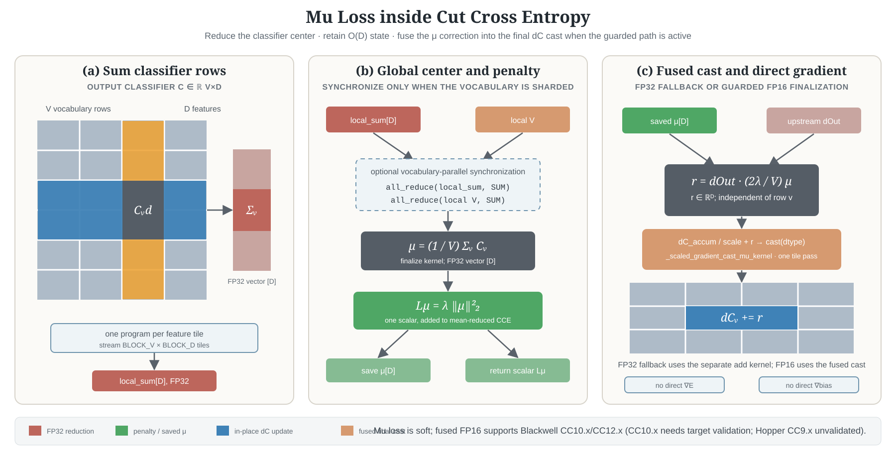
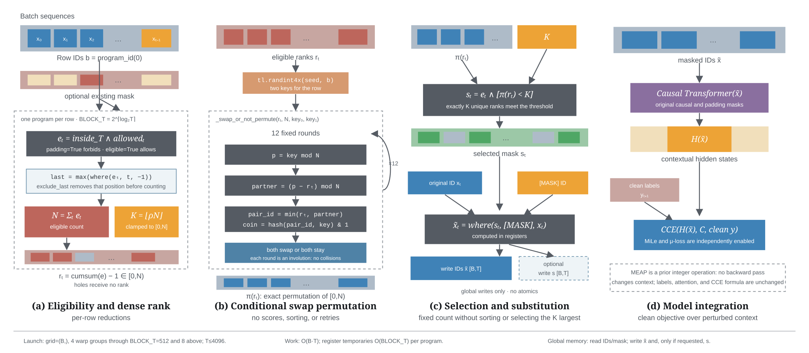

## Cut Your Losses in Large-Vocabulary Language Models

This software project accompanies the research paper:
**[Cut Your Losses in Large-Vocabulary Language Models](https://arxiv.org/abs/2411.09009)**,
*Erik Wijmans, Brody Huval, Alexander Hertzberg, Vladlen Koltun, and Philipp Krähenbühl*.


As language models grow ever larger, so do their vocabularies. This has shifted the memory footprint of LLMs during training disproportionately to one single layer: the cross-entropy in the loss computation. Cross-entropy builds up a logit matrix with entries for each pair of input tokens and vocabulary items and, for small models, consumes an order of magnitude more memory than the rest of the LLM combined. We propose Cut Cross-Entropy (CCE), a method that computes the cross-entropy loss without materializing the logits for all tokens into global memory. Rather, CCE only computes the logit for the correct token and evaluates the log-sum-exp over all logits on the fly. We implement a custom kernel that performs the matrix multiplications and the log-sum-exp reduction over the vocabulary in flash memory, making global memory consumption for the cross-entropy computation negligible. This has a dramatic effect. Taking the Gemma 2 (2B) model as an example, CCE reduces the memory footprint of the loss computation from 24 GB to 1 MB, and the total training-time memory consumption of the classifier head from 28 GB to 1 GB. To improve the throughput of CCE, we leverage the inherent sparsity of softmax and propose to skip elements of the gradient computation that have a negligible (i.e., below numerical precision) contribution to the gradient. Experiments demonstrate that the dramatic reduction in memory consumption is accomplished without sacrificing training speed or convergence.

## Getting started

**Requirements**

1. Python 3.9+
2. PyTorch 2.8+ on Triton-enabled platforms (PyTorch 2.4+ for the macOS fallback)
3. Triton 3.4+ on supported platforms
4. Ampere (or newer) GPU


**Note:**  For operating systems that are not supported by Triton (e.g., MacOS), we include a highly optimized version of
linear-cross-entropy using `torch.compile`. This implementation will be set to the default on MacOS.

The current CCE kernel architecture, numerical basis, autotune cache design,
and validation results are documented in
[docs/cce-modernization.md](docs/cce-modernization.md).
The compiler-safe boundary, supported `torch.compile` subset, and graph
validation are documented in [docs/torch-compile.md](docs/torch-compile.md).
The conservative FP32 rationale and the bounded Blackwell CC10.x/CC12.x FP16
path for MiLe, μ-loss, and MEAP are described in its
[mixed-accumulation section](docs/cce-modernization.md#mixed-fp16-accumulation-with-mile-and-loss).

> **Experimental status:** the fused mixed-precision μ-loss finalization is
> research/benchmark code, not a production-hardened guarantee. Keep the
> conservative FP32 path for critical training unless the forced or automatic
> route has been validated on the target GPU and training trajectory.

The automatic dispatch admits Blackwell CC10.x (including B100/B200) and
CC12.x devices. The CC10.x route is enabled at the code level but still needs
validation on the target system; Hopper CC9.x devices such as H100, H200, and
GH200 are intentionally left on FP32 because they are not validated here.

### Basic usage

**Installation**
```bash
pip install "cut-cross-entropy @ git+https://github.com/Kitsunp/ml-cross-entropy.git@main"
```

If replacing an existing upstream installation with this fork, force reinstall
the package without downloading PyTorch and Triton again:

```bash
pip install --force-reinstall --no-deps \
  "cut-cross-entropy @ git+https://github.com/Kitsunp/ml-cross-entropy.git@main"
```

**Usage**

Given a model loss computation that looks like the following,
```python
import torch.nn.functional as F

embeddings = model.compute_embedding(inputs)
classifier = model.get_classifier_weights()

logits = embeddings @ classifier.T

loss = F.cross_entropy(logits.float(), labels)
```

you can instead compute the loss as follows,

```python
from cut_cross_entropy import linear_cross_entropy

embeddings = model.compute_embedding(inputs)
classifier = model.get_classifier_weights()

# Note: There is no need to upcast embeddings or classifier to float32
# like you need to do with logits when using F.cross_entropy.
# The CCE kernel will automatically use fp32 for operations that are unstable
# in bf16/fp16.
loss = linear_cross_entropy(embeddings, classifier, labels)
```

In causal language modeling, it is common that the model embeddings and labels need to be shifted
such that the model predicts the next token.

```python
from cut_cross_entropy import linear_cross_entropy

embeddings = model.compute_embedding(inputs)
classifier = model.get_classifier_weights()

shift_embeddings = embeddings[..., :-1, :].flatten(0, -2)
shift_labels = labels[..., 1:]

manual_shift_loss = linear_cross_entropy(shift_embeddings, classifier, shift_labels)
```

Instead, pass `shift=1` to perform this computation without allocating the shift_embeddings matrix.
```python
from cut_cross_entropy import linear_cross_entropy

embeddings = model.compute_embedding(inputs)
classifier = model.get_classifier_weights()

# This is the same as manual_shift_loss above
auto_shift_loss = linear_cross_entropy(embeddings, classifier, labels, shift=1)
```

We also provide a highly optimized implementation of linear-cross-entropy loss using `torch.compile`.
This is a good option
for scenarios where speed is the primary goal and the model has a relatively small vocabulary compared to its
hidden dimension (when |V| >> D, `cce` will both save memory _and_ be faster).
This option also works on the CPU and older GPUs, making it useful for testing.

```python
from cut_cross_entropy import linear_cross_entropy

embeddings = model.compute_embedding(inputs)
classifier = model.get_classifier_weights()

loss = linear_cross_entropy(embeddings, classifier, labels, ..., impl="torch_compile")
```


There are several other implementations available depending on your needs.

| impl | Description |
|------|-------------|
| cce  | The CCE implementation as described in the paper. This is may be the fastest and uses the least amount of memory. Generally recommended to start here. |
| torch_compile | A highly optimized `torch.compile` implementation. This is typically the fastest but uses the most amount of memory. Good as a reference and for systems that don't support Triton. |
| cce_kahan | Legacy upstream name; it is not a selectable preset in this checkout. The active `*_full_*` presets below provide the corresponding FP32-safe accumulation controls. |
| cce_kahan_full_c | Legacy compatibility name for FP32-safe accumulation with classifier-gradient filtering disabled (embedding filtering remains enabled). The current Triton path uses FP32 lock/atomic reductions, not a separate classic Kahan/2Sum compensation tensor. On guarded Blackwell CC10.x/CC12.x BF16 shapes the automatic path may use bounded mixed FP16 buffers; with μ-loss enabled, the fused finalization adds its correction in the same cast pass. Hopper CC9.x devices (H100/H200/GH200) are intentionally not validated for this route and remain on FP32. Set `CCE_DE_ACCUM_DTYPE=fp32` and `CCE_DC_ACCUM_DTYPE=fp32` to force FP32. |
| cce_kahan_full_c_full_e (cce_exact) | Same compatibility family with both gradient filters disabled. It is retained as an audit/reference point rather than a claim that the reduction uses classic Kahan arithmetic. |


### MiLe Loss


MiLe loss can be explicitly enabled on any CCE implementation with
`mile_enabled=True`. The
recommended pretraining configuration keeps the complete classifier gradient
and FP32-safe accumulation while retaining block filtering for the embedding
gradient:

```python
loss = linear_cross_entropy(
    embeddings,
    classifier,
    labels,
    impl="cce_kahan_full_c",
    mile_enabled=True,
    mile_gamma=1.0,
)
```

CCE computes the entropy statistic in the fused forward kernel and applies the
MiLe-weighted CE gradient in the fused backward kernel. Enabling MiLe always applies the
stop-gradient and valid-token weight normalization used by the released MiLe
training code. It does not materialize logits or probabilities in global
memory. With `mile_enabled=False` (the default), the ordinary CCE path is used
and no MiLe statistics are allocated. `mile_gamma` only selects the exponent
while MiLe is enabled. MiLe is not supported by `impl="torch_compile"`.
See [`docs/mile.md`](docs/mile.md) for the objective, fused weight-kernel
branches, detached backward, memory contract, and validation coverage.

For training diagnostics, `return_loss_metrics=True` with `reduction="mean"`
returns `(loss, metrics)`. The compact device scalars
`ntp_ce_unweighted`, `mile_reweighting_delta`, and `mu_loss` sum back to
`loss`; no full-logit tensor is reconstructed.

### Mu loss



The output-classifier mean penalty can be enabled independently or together
with MiLe:

```python
loss = linear_cross_entropy(
    embeddings,
    classifier,
    labels,
    impl="cce_kahan_full_c",
    mile_enabled=True,
    mu_loss_enabled=True,
    mu_loss_lambda=1e-4,
)
```

This adds $\lambda\lVert\mathrm{mean}(C,\mathrm{dim}=0)\rVert_2^2$ to the
mean-reduced loss. Its reduction and direct classifier-gradient update are
implemented with Triton kernels, without materializing logits. The gradient is
added once to `dC` and does not alter `dE` or the bias gradient. This is a
classifier-centering regularizer, not logit centering: it does not subtract the
mean from the classifier during the forward pass. Mu loss currently requires
`reduction="mean"` and is not supported by `impl="torch_compile"`.
See [`docs/mu_loss.md`](docs/mu_loss.md) for the forward reduction, optional
vocabulary-parallel synchronization, direct classifier gradient, fused
FP32/guarded-FP16 finalization, and memory contract. A small-shape FP16 stress
test can explicitly set `CCE_MU_FUSED_CAST=1`,
`CCE_DE_ACCUM_DTYPE=fp16`, and `CCE_DC_ACCUM_DTYPE=fp16`; this is an expert
validation override, not a default production setting.

### MEAP input masking



[Mask-Enhanced Autoregressive Prediction (MEAP)](https://arxiv.org/abs/2502.07490)
is available as an explicit input operation. It is called **before** the model
forward, not from inside CCE: CCE receives hidden states after MEAP has changed
their causal context. Labels and the causal/padding attention masks remain
unchanged.

Reserve the mask token before model initialization so its input and output rows
use the model's normal vocabulary initialization. For this repository's padding
convention, `padding_mask=True` means that a position cannot be replaced.

```python
from cut_cross_entropy import linear_cross_entropy, meap_mask_inputs

# Keep clean_input_ids/labels unchanged for targets and evaluation.
model_input_ids = meap_mask_inputs(
    clean_input_ids,
    mask_token_id=tokenizer.mask_token_id,
    enabled=True,                 # explicit on/off switch
    mask_ratio=0.15,
    padding_mask=padding_mask,    # no boolean inverse allocation
    seed=global_step,
)

hidden = model(model_input_ids, padding_mask)
loss = linear_cross_entropy(
    hidden,
    model.get_output_embeddings().weight,
    labels,
    shift=1,
    impl="cce_kahan_full_c",
    mile_enabled=True,
    mile_gamma=1.0,
    mu_loss_enabled=True,
    mu_loss_lambda=1e-4,
)
```

The Triton kernel samples a fixed number of positions without replacement in
each sequence, excludes the last eligible input by default for `shift=1`, and
supports padded, non-packed batches up to sequence length 4096. It allocates
only the output IDs unless `return_mask=True`; `enabled=False` is a zero-copy
no-op. Use a seed derived from global step, microstep, and distributed rank, and
create the masked IDs outside activation-checkpointed regions. A readable
`implementation="torch"` path is provided for validation. See
[`docs/meap.md`](docs/meap.md) for the contract and integration details. The
kernel maps eligible positions through twelve keyed
swap-or-not permutation rounds, avoiding rejection loops, random-score tensors,
sorting, and top-k selection.
For compiled training, pass a scalar int32/int64 CUDA tensor as `seed` when its
value changes each step. This keeps the seed dynamic and avoids one Dynamo graph
specialization per Python integer value; Python integer seeds remain supported.
For int64 device seeds, the kernel folds the high and low halves into the
32-bit Philox seed so packed step, microstep, and rank bits are not discarded.
With `return_metrics=True`, the kernel additionally returns the two scalar
counters `[eligible_count, masked_count]` without allocating the boolean token
mask required by `return_mask=True`.


### Vocabulary Parallelism

We also support computing linear cross-entropy loss for classifier weights sharded
along the vocabulary dimensions. To use this, provided a `VocabParallelOptions` instance
to `linear_cross_entropy`. This takes 3 parameters, the `start` and `stop` indices of this rank's
shard, and the `torch.distributed.ProcessGroup` for this rank's vocab parallel group.


```python
import torch

from cut_cross_entropy import linear_cross_entropy, VocabParallelOptions

# The vocab parallel group for this rank.
#  This group can be created/retrieved in many different ways,
# for instance,
# torch.distributed.new_group(...)
# device_mesh.get_group(mesh_dim="model_parallel")
# etc
vp_group = ...


embeddings = model.compute_embedding(inputs)
vp_classifier = model.get_classifier_weights()

vp_start, vp_stop = model.get_classifier_range()
vp_opts = VocabParallelOptions(vp_start, vp_stop, group=vp_group)

# alternatively, there is an option to create this
# by linearly dividing the vocab across ranks
vp_opts = VocabParallelOptions.from_vocab(model.vocab_size, group=vp_group)

# All ranks in the vocab parallel group will return the same loss
loss = linear_cross_entropy(embeddings, vp_classifier, labels, ...,
  vocab_parallel_options=vp_opts)

loss.backward()

# All ranks will compute the same embeddings.grad, but each rank will have only the classifier gradient
# corresponding to its part of the full classifier matrix (as defined by vp_classifier).
```


### Computing Related Quantities

`linear_cross_entropy` can be used as an efficient way to compute the negative log likelihood
of a specified token. This can be used to compute various quantities.


```python
from cut_cross_entropy import linear_cross_entropy


# linear_cross_entropy computes negative log likelihood for a target token
nll = linear_cross_entropy(embeddings, classifier, target_token, reduction="none")

# Perplexity
ppl = torch.exp(nll.mean(-1))

# DPO (beta and reference omitted)
dpo_loss = -F.logsigmoid(nll[dispreferred].sum(-1) - nll[preferred].sum(-1))

# PPO
ppo_loss = -torch.minimum(toch.exp(-nll - old_logp) * adv, adv + eps * adv.abs())
```


### Z Loss

`linear_cross_entropy` can also be used to compute Z loss (a loss on the logsumexp).

```python
from cut_cross_entropy import linear_cross_entropy

loss, lse = linear_cross_entropy(embeddings, classifier, labels, ..., return_lse=True)

z_loss = lse.pow(2).mean()

# We also have a helper function to compute Z loss that will automatically remove ignored tokens/etc.
from cut_cross_entropy.utils import compute_z_loss

z_loss = compute_z_loss(lse, labels, shift=shift)


loss = loss + z_loss_weight * z_loss
```


### Generalized Usage

While we have discussed using CCE in the context of large language models, the only constraint
to use CCE is that loss can be formulated using something that resembles following:

```python
logits = X @ A.T + b  # (b is an optional bias)
loss = F.cross_entropy(logits.float(), targets)
```

Given that format, CCE can then be used as
```python
loss = linear_cross_entropy(X, A, target_token, bias=b)
```

This is a very general and encompasses vision models, contrastive losses, e.g. CLIP, etc.


### Transformers Integration

**Installation**

Install cut-cross-entropy with transformers dependencies
```bash
pip install "cut-cross-entropy[transformers] @ git+https://github.com/Kitsunp/ml-cross-entropy.git@main"
```

**Usage**

If you are using transformers, you can patch transformers to use CCE directly. Note that
logits will no longer be returned (`None` will be returned instead).
```python
from cut_cross_entropy.transformers import cce_patch

cce_patch("llama")

# or

model = ...
model = cce_patch(model)
```

We currently support the Llama, Phi3, Mistral, and Gemma2 families of models.

`cce_patch` takes two options. The first is the linear-cross-entropy implementation to use. Currently `"cce"` or `"torch_compile"`.

The second
is the loss reduction. We support `"mean"`, `"sum"`, and `"none"`, that mirror their PyTorch counterpart.
`"mean"` is the default and what the transformers trainer API expects.
However,
`"none"` in particular can enable for efficient computation of quantities based on the loss.

For example, the following efficiently computes the perplexity of a batch of sequences:
```python
import transformers

from cut_cross_entropy.transformers import cce_patch


model = transformers.AutoModelForCausalLM.from_pretrained(...)

model = cce_patch(model, reduction="none")

labels = input_ids.clone()
labels[~attention_mask] = -100 # -100 is the ignore index for PyTorch and CCE.

outputs = model(input_ids, attention_mask, labels=labels)

loss = outputs[0] # A (B, T - 1) tensor because reduction="none". T - 1 because the first input token has
# no loss.

ppl = torch.exp(
    # [:, 1:] because the first token has no loss
    loss.sum(1) / (labels[:, 1:] != -100).count_nonzero(dim=1)
).mean()  # Average perplexity over the batch
```


### Training and reproducing the benchmark results

We provide a training in `training/train.py`.

**Installation**
```bash
pip install "cut-cross-entropy[all] @ git+https://github.com/Kitsunp/ml-cross-entropy.git@main"
```

**Training**

Use `scripts/train.sh` to train a full model.

**Benchmarking**

The benchmark script can be run via `python -m benchmark`.

For the direct CCE latency and memory harness used by the second Blackwell
engineering update, run:

```bash
python -m benchmark.cce_profile --root . --batch 64 --seq 512 --hidden 512 --vocab 64402
```

An optional `--memory-limit-gib 9.5` cap applies only to the benchmark process
and is used for 10 GiB test budgets; it does not affect the library or training.
The engineering flow, environment versions, complete RTX 5070 Ti/5090 tables,
numerical checks, and batch-sweep commands are in
[CCE Blackwell engineering update 2](docs/cce-blackwell-update-2.md). The
[original modernization record](docs/cce-modernization.md) remains available
separately.

Expected output with A100 SMX4, PyTorch 2.4.1, and CUDA 12.4.

```
          method        kind  runtime_ms  op_mem_mb test_data
0            cce     loss-fw        46.4        1.1    gemma2
1  torch_compile     loss-fw        49.9     4000.1    gemma2
2       baseline     loss-fw        81.9    24000.0    gemma2
3            cce     loss-bw        89.3     1163.0    gemma2
4  torch_compile     loss-bw        92.3    12000.0    gemma2
5       baseline     loss-bw       122.4    16000.0    gemma2
6            cce  loss-fw-bw       134.8     1164.0    gemma2
7  torch_compile  loss-fw-bw       144.0    16000.1    gemma2
8       baseline  loss-fw-bw       208.8    28000.0    gemma2
```

### Development

If dependencies are installed locally, `cut-cross-entropy` will work without a pip install as long as `python` is executed in the root path of the github repo.

To install directly from the github repo, either use an (editable) install or manipulate PYTHONPATH, e.g.

```bash
pip install -e ".[dev]"

# or
pip install ".[dev]"

# or
export PYTHONPATH=/path/to/ml-cross-entropy:${PYTHONPATH}
```

## Citation

```
@inproceedings{wijmans2025cut,
  author       = {Erik Wijmans and
                  Brody Huval and
                  Alexander Hertzberg and
                  Vladlen Koltun and
                  Philipp Kr\"ahenb\"uhl},
  title        = {Cut Your Losses in Large-Vocabulary Language Models},
  booktitle    = {International Conference on Learning Representations},
  year         = {2025},
}
```


## License
This sample code is released under the [LICENSE](LICENSE) terms.

## Acknowledgements

Our codebase is built using multiple opensource contributions, please see [Acknowledgements](ACKNOWLEDGEMENTS.md) for more details.

Please check the paper for a complete list of references and datasets used in this work.
