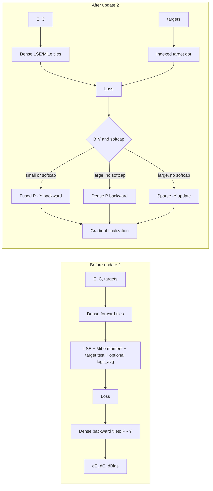

# CCE Blackwell engineering update 2

This document records the August 2026 follow-up to the original
[CCE kernel modernization](cce-modernization.md). The first update's lock/split
forward architecture, FP32 atomic backward path, accumulation policy, public
presets, and numerical contract remain in place. This second update removes
work from the hot kernels, adjusts their geometry, and validates the resulting
implementation on consumer Blackwell GPUs.

The measurements below cover direct `cce_kahan_full_c` execution with MiLe and
mu-loss. No production compile mode, environment switch, or new public flag was
added by this update.

## Engineering changes

### Sparse target work

The target contribution is one-hot in vocabulary. Computing it inside every
`B x V` tile repeats a comparison and target-dependent epilogue across the
entire dense probability surface even though only one vocabulary row is active
per token.

The lock/MiLe forward path now obtains the correct-class logit with an indexed
`O(BD)` kernel. Its main LSE/MiLe kernel therefore contains only the dense
reduction. Normal CCE execution also stops producing and sorting the unused
vocabulary-wide `logit_avg` tensor. The existing split-V path retains its fused
target store because each split already owns a disjoint vocabulary interval;
this update does not force an extra launch onto that separate architecture.
FP32 with global matmul precision `high` also keeps the target fused: its dense
tile uses TF32 products, whereas an indexed scalar dot is IEEE. Keeping both LSE
and target in the same tile prevents mixed-product semantics. The measured BF16
training path remains indexed even when the global policy is `high`.

Backward uses two paths:

- below `B * V = 2^24`, the target subtraction stays fused because an extra
  launch costs more than the saved epilogue work;
- at or above that boundary, the dense kernel evaluates the probability term
  and a compact `O(BD)` kernel applies the target updates to `dE`, `dC`, and
  optional bias.

This threshold is based on the amount of dense work, not a GPU product name.
It keeps the small `B=1` case from regressing while removing target work from
large launches.

### Geometry and launch topology

- The fixed forward geometry is `128 x 128 x 32`, four warps, three stages.
- The consumer low-shared-memory backward geometry keeps the `128 x 128`
  tensor-core surface but uses `BLOCK_D=16`, four warps, and two stages.
- `GROUP_B=16` improves classifier locality on the measured Blackwell shapes.
- The lock forward path launches an aligned vocabulary prefix through an
  even-`V` specialization and handles only the unaligned tail with masks.
- Redundant debug barriers were removed after verifying the generated kernels.
- Shared mixed-accumulation scaling is converted once and reused by both
  gradient destinations.

The geometry was selected from a small, pre-existing curated candidate set and
then checked across batches, sequence lengths, hidden sizes, and odd vocabulary
sizes. It was not selected by an unrestricted brute-force search.

### Mu-loss reduction

The classifier mean previously left too little parallel work on large GPUs.
It now uses a bounded hierarchical reduction: vocabulary blocks produce FP32
partial sums and a second kernel reduces at most 32 power-of-two splits. The
split count depends on vocabulary blocks, hidden-dimension blocks, and active
SM count. Capping it at an available power of two also handles odd sizes such
as `V=2,053` without creating an invalid Triton `tl.arange` extent.

### Compiler boundary

Removing `logit_avg` changed the tensors needed by backward. The real custom
operator, fake implementation, autograd setup, saved-tensor tuple, and backward
operator now share the same contract. This fixed the earlier
`expected 10, got 9` unpacking failure. Direct and compiled CCE still execute
the same mathematical kernels.

## Design audit and derivation

### The decomposition that makes the change exact

For token row `b`, vocabulary row `v`, and hidden dimension `D`, CCE reconstructs

```text
z[b,v] = dot(E[b,:], C[v,:]) + bias[v]
p[b,v] = exp(z[b,v] - lse[b])
```

and, without softcapping, the cross-entropy logit derivative is

```text
G[b,v] = scale[b] * weight[b] * (p[b,v] - 1[v = target[b]])
```

where `weight` is one for ordinary CE or the detached normalized MiLe weight.
Matrix-gradient linearity gives

```text
dE = (scale * weight * P) @ C
     - row_scale[:, None] * C[target, :]

dC = (scale * weight * P).T @ E
     - scatter_add(target, row_scale[:, None] * E)

dBias = sum_rows(scale * weight * P)
        - scatter_add(target, row_scale)
```

The dense probability term and sparse one-hot term can therefore be evaluated
by different kernels without changing the derivative. The sparse backward
kernel uses direct stores for `dE`, because each valid token owns one row, and
relaxed GPU-scope atomics for `dC` and bias, because several tokens may share a
target class. That atomic ordering has the same rounding class already present
in the parallel FP32 classifier accumulation.

Softcapping applies a logit-dependent derivative to both terms. The production
selector therefore keeps the target fused whenever `softcap` is active instead
of silently applying the simpler decomposition outside its valid domain. Shift,
ignored targets, packed `valids`, scalar/per-token upstream gradients, MiLe
weights, bias, partial gradients, and accumulation scales are all explicit
inputs to the sparse kernel.

Forward uses the corresponding identity

```text
loss[b] = logsumexp(z[b,:]) - z[b,target[b]]
```

so the LSE reduction and indexed target dot product do not need to share a CTA.
The indexed kernel performs the same BF16/FP16 round-to-nearest-even logit cast,
then applies bias and optional softcap before writing the FP32 negative target
logit. It allocates only the `B`-element result already required by the loss;
it never creates `B x V` logits.

### Why the backward path is adaptive

Splitting a sparse term is not free. A separate kernel adds launch latency and
scattered classifier writes. Fusing the target comparison, however, evaluates
it in every dense `B x V` tile and keeps target-dependent predicates in the hot
epilogue.

The selector uses `B * V >= 2^24` as the crossover:

| Surface | Dense kernel | Target work | Reason |
|---|---|---|---|
| small, or any softcap | probability and target fused | no extra launch | launch latency dominates |
| large and no softcap | probability only | separate `O(BD)` launch | removes target predicates from the hot `O(BV)` surface |

The boundary was derived from paired measurements, including the initially
adverse `B=1,S=64,D=256,V=8,192` case. It depends on work size rather than GPU
identity, leaves margin for different SM counts, and avoids a collection of
per-shape exceptions.

### How profiling changed the design

The optimization was applied in measured slices rather than as one rewrite.
The first profile isolated the target-dependent epilogue from the dominant
forward kernel. Separating the target reduced that hot-kernel sample to about
21.75 ms and reduced static PTX reduction-operation occurrences from 223 to
121. Removing the unused normal-path `logit_avg` work with it improved forward
by only about 5% at that stage. That result was important: it showed that the
epilogue was real overhead, but also that epilogue removal alone could not meet
the throughput goal.

The lighter kernel changed register pressure, shared-memory use, and the amount
of work scheduled per CTA, so the geometry selected for the older epilogue was
no longer assumed optimal. Only then was the existing bounded six-candidate
autotuner rerun. The resulting `128 x 128 x 32` forward tile produced the larger
end-to-end gains in the final table. This ordering separates two effects:

1. remove mathematically redundant hot-path work;
2. retune the now-different kernel rather than preserving stale scheduling.

Backward profiling showed a different limit. On the large representative
shape, the aggregate main-kernel rate was about 209 TFLOP/s against a measured
218.5 TFLOP/s BF16 matrix-multiply microbenchmark on the same RTX 5090, roughly
95.7% of that local compute reference. Consequently, update 2 focuses backward
changes on eliminating target epilogue work, launch topology, and memory passes;
it does not claim that scheduling alone can provide another universal 30% once
the dense reconstruction is already near the measured compute ceiling.

### Before and after



The two branches share output buffers and finalization; the change is a
decomposition of work, not a duplicated gradient representation.

### Geometry reasoning

`BLOCK_B` and `BLOCK_V` define the tensor-core surface. Keeping both at 128
preserves a large MMA tile and avoids increasing the number of programs. The
hidden tile controls a different trade-off: larger `BLOCK_D` reduces loop
iterations but increases live operands and shared-memory demand in the
backward epilogue.

The first modernization's small `32 x 128` low-memory fallback solved an
allocation constraint by multiplying program count. Update 2 instead keeps the
`128 x 128` surface and changes only the hidden slice to 16 with two pipeline
stages. The backward matrix-update helper then processes 32 hidden elements per
iteration. This stays below the consumer GPU shared-memory ceiling without
turning long contexts or large batches into many additional CTAs.

Forward has a lighter epilogue after target extraction and `logit_avg` removal.
Rechecking the existing six curated candidates selected `BLOCK_D=32`, four
warps, and three stages. This improved the measured `D=512`, `D=768`, and
`D=1,024` cases without adding a runtime tuner or a product-specific table.

`GROUP_B=16` is a launch-order swizzle, not an optimizer parameter. A group
walks 16 token tiles while traversing vocabulary tiles, increasing the chance
that classifier rows remain useful in cache. It changes neither tile ownership
nor reduction order within a tile.

In lock forward, the aligned prefix specializes `EVEN_V=True`: classifier and
bias loads and the LSE/MiLe reduction no longer carry tail predicates. For an
odd vocabulary, only the final `V mod 128` rows use a masked forward launch. The
extra launch is bounded while the dominant aligned forward work stays
branch-free. Backward uses its even-`V` specialization when the complete
vocabulary is aligned; odd backward shapes retain masks rather than adding
another scatter/update launch.

### Stable LSE and MiLe moment

The forward reduction remains numerically stable. Each tile first subtracts
its maximum. For MiLe it reduces the pair

```text
(sum(exp(z - max)), sum(exp(z - max) * (z - max)))
```

in one paired reduction, then combines tile states with log-add-exp weights.
The reconstructed expectation is

```text
E_p[z] = max + weighted_sum / exp_sum
```

and entropy follows from `LSE - E_p[z]`. Forward and backward both use IEEE dot
products when MiLe is active, so backward reconstructs the logits used to
evaluate the loss rather than mixing an IEEE forward with a TF32 derivative.

### Mu-loss occupancy and memory traffic

For classifier mean

```text
mu = sum(C, dim=0) / V
L_mu = lambda * dot(mu, mu)
dC_mu[v,:] = 2 * lambda * mu / V
```

a single reduction per hidden block cannot occupy 170 SMs when `D` is modest.
The hierarchical route assigns several vocabulary streams to each hidden block,
stores FP32 partials, and reduces them in a second launch. Its split policy is

```text
desired   = next_power_of_2(ceil(2 * SMs / ceil(D / 32)))
available = largest power of two <= ceil(V / 128)
splits    = min(desired, available, 32)
```

Thus it creates enough parallel work to cover latency but bounds temporary
state to at most `32 * D * 4` bytes. Requiring a supported power-of-two extent
also satisfies Triton's compile-time `tl.arange` constraint for irregular
vocabularies.

When the guarded mixed accumulator is active, final classifier casting and the
mu-gradient addition share one pass. This avoids rereading and rewriting the
entire classifier gradient solely for the regularizer.

### Memory model

The dominant buffers remain the selected `dE` and `dC` accumulators. Update 2
does not materialize logits and does not add a second gradient copy:

| Component | Size | Update 2 effect |
|---|---:|---|
| dense logits | `B * V * dtype_size` | still absent |
| LSE / target logit / MiLe state | `O(B)` FP32 | unchanged order |
| sparse target backward | no workspace | writes existing gradients |
| mu partials | at most `32 * D` FP32 | small bounded workspace |
| `logit_avg` and vocabulary ordering in normal CCE | `O(V)` | removed |
| gradient accumulators | `O((B+V)D)` | same policy as update 1 |

This explains why final RTX 5090 peak allocation stayed between 0.1% and 0.4%
below the baseline in the representative table: the speedup comes from less hot
work and better scheduling, not from exchanging memory for performance.

### `torch.compile` contract

The compiled CCE boundary is a custom operator with an explicit fake
implementation and registered autograd formula. Those pieces must agree on
both tuple length and tensor meaning:

```text
real forward outputs
    == fake forward outputs
    == tensors unpacked by autograd setup
    == tensors consumed by the custom backward
```

After normal execution stopped requesting `logit_avg`, the old saved-tensor
tuple still expected that output. Removing it from only the eager side produced
`expected 10, got 9`. Update 2 removes it consistently from the real/fake
schemas, saved tensors, backward inputs, and returned-gradient mapping. The
outer model can therefore keep CCE as one graph-safe operator while Triton
still owns the internal launches. No compile mode or Dynamo limit is changed.

## Test environments

| GPU | Compute | PyTorch | Triton | CUDA | Notes |
|---|---:|---|---|---|---|
| RTX 5090 | 12.0, 170 SM | 2.13.0+cu130 | 3.7.1 | 13.0.2 | Python 3.13, 32 GiB device; full device limit |
| RTX 5070 Ti | 12.0, 70 SM | 2.12.1+cu130 | 3.7.1 | 13.0 | 15.92 GiB device; benchmark process capped below 10 GiB |

The 9.5 GiB process-only cap was used on the RTX 5070 Ti. The RTX 5090 rerun used
the full 32 GiB process limit. Neither setting is present in the CCE library or
limits training.

### `high` versus `highest`

The final BF16 MiLe+mu path was measured under both global matmul policies. MiLe
selects IEEE products explicitly so forward and backward reconstruct the same
logits; consequently the policy does not change the active Triton dot mode.

| Geometry | `high` fwd/bwd/total | `highest` fwd/bwd/total | Total difference | Peak allocation |
|---|---:|---:|---:|---:|
| `B=16,S=512,D=1,024,V=32,000` | 2.741 / 5.225 / 7.966 ms | 2.719 / 5.224 / 7.946 ms | `highest` 0.25% faster | 230,364,672 bytes in both |
| `B=64,S=512,D=512,V=64,402` | 10.163 / 20.739 / 30.902 ms | 10.173 / 20.740 / 30.915 ms | `high` 0.04% faster | 265,741,312 bytes in both |

The largest directional difference was 0.82% and backward differed by at most
0.01%. These shifts are within ordinary run-to-run timing variation; `high`
does not provide a measurable speed or memory advantage for this BF16 MiLe
route.

## RTX 5090 final-source results

Times are CUDA-event medians after warmup with
`torch.set_float32_matmul_precision("high")`. Baseline and candidate use
identical inputs and objective. `Total` was measured directly and may differ
slightly from the sum of independently sampled forward/backward medians.

| B | S | D | V | Baseline fwd | Current fwd | Gain | Baseline bwd | Current bwd | Gain | Baseline total | Current total | Gain | Peak memory change |
|---:|---:|---:|---:|---:|---:|---:|---:|---:|---:|---:|---:|---:|---:|
| 1 | 64 | 256 | 8,192 | 0.329 ms | 0.278 ms | 15.3% | 0.220 ms | 0.174 ms | 21.2% | 0.547 ms | 0.453 ms | 17.3% | -0.4% |
| 16 | 512 | 768 | 50,003 | 4.174 ms | 3.162 ms | 24.2% | 8.112 ms | 6.108 ms | 24.7% | 12.286 ms | 9.270 ms | 24.5% | -0.2% |
| 16 | 512 | 1,024 | 32,000 | 3.113 ms | 2.717 ms | 12.7% | 7.160 ms | 5.226 ms | 27.0% | 10.274 ms | 7.944 ms | 22.7% | -0.1% |
| 64 | 512 | 512 | 64,402 | 17.210 ms | 10.170 ms | 40.9% | 27.851 ms | 20.738 ms | 25.5% | 45.056 ms | 30.908 ms | 31.4% | -0.2% |
| 7 | 257 | 384 | 32,771 | 0.895 ms | 0.462 ms | 48.3% | 0.770 ms | 0.514 ms | 33.2% | 1.665 ms | 0.977 ms | 41.3% | -0.3% |

Across these final-source geometries, total latency improved by 17.3% to 41.3%
(27.4% mean). Forward improved by 12.7% to 48.3% (28.3% mean), and backward by
21.2% to 33.2% (26.3% mean). The tiny total and the `D=1,024` forward result are
explicitly below a 20% target; the table reports both rather than hiding the
limits.

### Batch scaling

The following sweep used `S=512`, `D=512`, and `V=50,257`. It was measured just
before the final `BLOCK_D=32` forward retune. That retune subsequently improved
the representative `B=16` forward from 2.262 ms to 2.227 ms and did not change
the backward algorithm, so this is a conservative scaling record.

| Batch | Baseline fwd | Candidate fwd | Gain | Baseline bwd | Candidate bwd | Gain |
|---:|---:|---:|---:|---:|---:|---:|
| 1 | 1.040 ms | 0.568 ms | 45.3% | 0.516 ms | 0.383 ms | 25.8% |
| 4 | 1.515 ms | 0.782 ms | 48.4% | 1.544 ms | 1.116 ms | 27.7% |
| 8 | 2.294 ms | 1.283 ms | 44.1% | 2.925 ms | 2.122 ms | 27.5% |
| 16 | 3.869 ms | 2.262 ms | 41.5% | 5.688 ms | 4.126 ms | 27.5% |
| 32 | 7.089 ms | 4.215 ms | 40.5% | 11.208 ms | 8.147 ms | 27.3% |
| 64 | 13.373 ms | 8.142 ms | 39.1% | 22.239 ms | 16.222 ms | 27.1% |
| 128 | 26.095 ms | 16.006 ms | 38.7% | 44.225 ms | 32.400 ms | 26.7% |

The forward advantage narrows as the launch becomes compute-saturated but
remains 38.7% at batch 128. Backward remains within 25.8%-27.7% across the
sweep.

## RTX 5070 Ti compatibility checkpoint

These measurements preserve the last locally measured checkpoint of the second
update. They predate the final 5090-only target threshold and `BLOCK_D=32`
retune, so they are compatibility evidence rather than a claim for the final
source head.

| Geometry | Baseline fwd | Checkpoint fwd | Gain | Baseline bwd | Checkpoint bwd | Gain | Total gain |
|---|---:|---:|---:|---:|---:|---:|---:|
| `B=64,S=512,D=512,V=64,402` | 24.05 ms | 20.41 ms | 15.1% | 58.07 ms | 44-45 ms | 22-24% | 20-22% |
| `B=8,S=512,D=512,V=50,257` | 8.39 ms | 6.24 ms | 25.6% | 18.59 ms | 14.67 ms | 21.1% | 22.5% |
| `B=16,S=512,D=768,V=50,003` | 5.63 ms | 5.17 ms | 8.2% | 14.68 ms | 12.36 ms | 15.8% | 13.7% |

The final source therefore still needs a fresh 5070 Ti run before asserting a
15% minimum for every direction and geometry. The benchmark command below
retains a test-only 9.5 GiB cap for that run.

## Numerical validation

The final source was compared with a dense FP32 reference while updating BF16
model tensors through FP32 masters at the training learning rate `4e-4` and the
global matmul policy `high`. Uniform, normalized, and sharp logit regimes were
evaluated.

| Steps | Regime | FP32 classifier-master relative L2 | FP32 input-master relative L2 | Maximum sampled gradient relative L2 | Finite |
|---:|---|---:|---:|---:|---|
| 500 | uniform | 1.05e-7 | 5.84e-7 | 0.0294% | yes |
| 500 | normalized | 1.58e-5 | 1.76e-7 | 0.167% | yes |
| 500 | sharp | 7.56e-6 | 9.29e-7 | 0.274% | yes |
| 5,000 | uniform | 7.23e-7 | 3.48e-6 | 0.0277% | yes |
| 5,000 | normalized | 1.39e-4 | 9.48e-7 | 0.272% | yes |
| 5,000 | sharp | 5.96e-5 | 3.81e-6 | 0.274% | yes |

No non-finite loss, gradient, or master parameter appeared. This is a repeated
trajectory check rather than a claim of bitwise identity.

## Compiler and regression validation

- `tests/test_cce_compile.py`: 23 passed. The fused-small, separated-large, and
  packed-valids probes each produced one unique graph and zero graph breaks;
  maximum loss difference was `9.54e-7` and maximum gradient relative L2 was
  `0.01356%`.
- The focused mu-loss, LSE, MiLe, and compiler group passed 113/113 cases after
  the final FP32-`high` target-product consistency correction.
- `tests/test_cce_loss_backward.py -k "not torch_compile"`: 1,734 passed, 865
  deselected.
- The dense `torch_compile` reference passed 288/288 cases in each isolated
  dtype process: FP32, FP16, and BF16 (864 total).
- The monolithic Cartesian test reached 1,885 passes before PyTorch 2.13's
  dense reference `impl="torch_compile"` exceeded its per-code-object limit of
  256 accumulated specializations. The failing cases pass in fresh processes.
  This is why reference validation is split by dtype below; no Dynamo limit is
  raised.
- `ruff check` on the changed production modules and `git diff --check` passed.

The compiler-limit failure is not in the CCE custom operator. The Cartesian
test deliberately alternates shapes, optional arguments, and FP32/FP16/BF16 on
one `fullgraph=True` reference function. Long training with a stable dtype and
bounded shape buckets reuses compiled graphs instead of creating one
specialization per step.

## Reproducing latency

The repository includes `benchmark/cce_profile.py`. It reports median, mean,
minimum, p95, maximum, memory, environment versions, and finite-value checks.
It performs one cold step, eight warmup steps, and 40 measured steps by default.

```bash
python -m benchmark.cce_profile \
  --root . \
  --batch 64 --seq 512 --hidden 512 --vocab 64402 \
  --objective mile_mu --warmup 8 --repeats 40
```

On a 10 GiB test budget, append `--memory-limit-gib 9.5`. Omitting it leaves
the process uncapped, as in the final RTX 5090 rerun.

To compare two worktrees, run the same script once per root in a fresh process:

```bash
python -m benchmark.cce_profile --root /path/to/baseline --batch 64 --seq 512 --hidden 512 --vocab 64402
python -m benchmark.cce_profile --root /path/to/candidate --batch 64 --seq 512 --hidden 512 --vocab 64402
```

Batch sweep on Linux:

```bash
for b in 1 4 8 16 32 64 128; do
  python -m benchmark.cce_profile --root . --batch "$b" --seq 512 --hidden 512 --vocab 50257
done
```

Equivalent PowerShell:

```powershell
1, 4, 8, 16, 32, 64, 128 | ForEach-Object {
  python -m benchmark.cce_profile --root . --batch $_ --seq 512 --hidden 512 --vocab 50257
}
```

Compiler validation is intentionally partitioned without changing Dynamo
limits:

```bash
pytest -q tests/test_cce_compile.py
pytest -q tests/test_cce_loss_backward.py -k "not torch_compile"
pytest -q tests/test_cce_loss_backward.py -k "torch_compile and dtype0"
pytest -q tests/test_cce_loss_backward.py -k "torch_compile and dtype1"
pytest -q tests/test_cce_loss_backward.py -k "torch_compile and dtype2"
```
