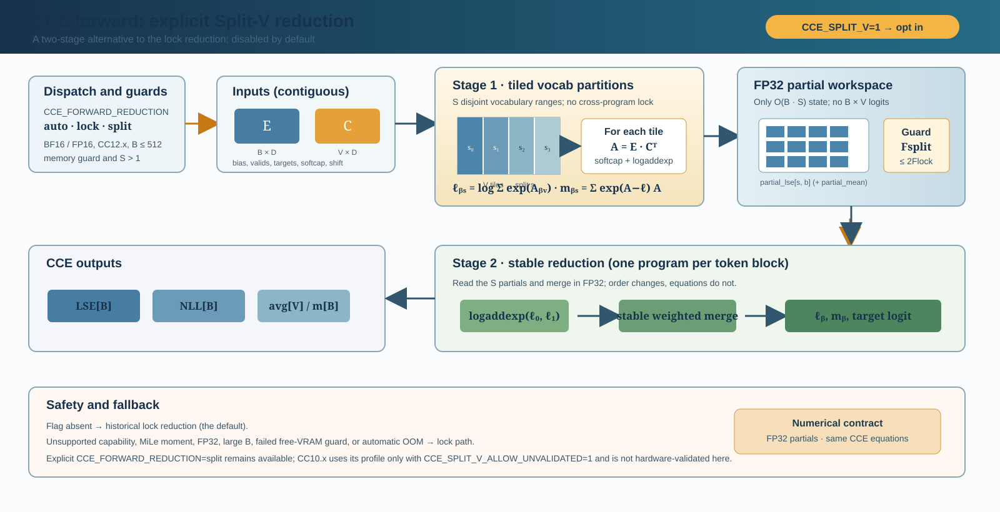

# CCE kernel modernization: design, mathematics, and validation

This document records the July 2026 modernization of the Cut Cross-Entropy
(CCE) Triton implementation. It focuses on the `cce_kahan_full_c` preset, while
also covering changes shared by the forward and backward kernels.

## Goals and non-goals

The work had five concrete goals:

1. Remove the Triton 3.2-and-older compatibility implementation.
2. Preserve the public CCE preset names and their numerical behavior.
3. Reduce lock contention and add a lock-free forward reduction architecture.
4. Make autotuning cheaper, mode-aware, and persistent across processes.
5. Verify numerical accuracy, memory, speed, optional features, and regressions.

The work does not claim that one launch topology is optimal for every GPU or
shape. Architecture selection is deliberately conservative and both forward
paths remain force-selectable for diagnosis.

## Mathematical basis

For token representation $e_b \in \mathbb{R}^D$, classifier row
$c_v \in \mathbb{R}^D$, and optional bias $a_v$, the logit and token loss are

$$
z_{bv} = e_b^\mathsf{T}c_v + a_v,
\qquad
\mathcal{L}_b = \log\!\sum_{v=1}^{V} \exp(z_{bv}) - z_{b,y_b}.
$$

CCE never materializes the $B\times V$ logit matrix. It evaluates tiles of
$E C^\mathsf{T}$ and reduces them directly into the log-sum-exp (LSE). The
backward kernel reconstructs the same tiles and applies

$$
\frac{\partial \mathcal{L}_b}{\partial z_{bv}}
= p_{bv} - \mathbf{1}[v=y_b],
\qquad
p_{bv}=\exp(z_{bv}-\mathrm{LSE}_b).
$$

It then accumulates

$$
\nabla_E = (P-Y)C,
\qquad
\nabla_C = (P-Y)^\mathsf{T}E.
$$

### What `cce_kahan_full_c` means now

The preset name is retained as a backward-compatible API name. Its forced/base
contract (and its fallback outside the mixed-precision guards) is:

- accumulate $\nabla_C$ in an FP32 output buffer;
- accumulate $\nabla_E$ in FP32 and retain the configured $E$-gradient filter;
- cast final gradients back to the parameter dtype at the API boundary.

On eligible Blackwell CC10.x/CC12.x BF16 shapes, the preset's automatic mode
may replace these temporary FP32 buffers with the bounded mixed-accumulation
route described below; forcing both accumulation environment variables to
`fp32` restores the contract above exactly. CC10.x dispatch support covers
B100/B200 at the code level but still needs target-hardware validation. Hopper
CC9.x devices (H100/H200/GH200) are not validated for this route and remain on
FP32.

It no longer runs compensated Kahan/2Sum arithmetic. That implementation only
worked around an old Triton accumulator limitation and required a second
compensation tensor. With Triton 3.4+ the FP32 output buffer is the simpler and
more accurate representation. The legacy preset name must therefore not be
interpreted as a statement about the current reduction algorithm.

The same naming caveat applies to the upstream `cce_kahan` label: it is not a
selectable preset in this checkout. In the current code, the `*_full_*` presets
select FP32-safe accumulation and gradient-filter policies; the word “Kahan” is
kept only for API familiarity with the upstream names. The active reduction uses
lock-protected or relaxed FP32 atomic updates, depending on the destination and
the selected reduction mode. It does not allocate a Kahan compensation tensor.
`cce_kahan_full_c` specifically means `filter_c_grad=False` and
`filter_e_grad=True`; `cce_kahan_full_c_full_e`/`cce_exact` disables both filters.

## Forward architectures

### Lock reduction

The original forward launch assigns one program to every $(B,V)$ tile. Programs
covering the same token rows merge their local LSE under a spinlock:

$$
\ell_{\mathrm{new}}
= \mathrm{logaddexp}(\ell_{\mathrm{old}},\ell_{\mathrm{tile}}).
$$

For MiLe's softmax-weighted logit moment, the corresponding stable merge is

$$
m_{\mathrm{new}}
= e^{\ell_{\mathrm{old}}-\ell_{\mathrm{new}}}m_{\mathrm{old}}
{}+ e^{\ell_{\mathrm{tile}}-\ell_{\mathrm{new}}}m_{\mathrm{tile}}.
$$

This path has minimal temporary memory and remains useful for MiLe, FP32, and
large-$D$/large-batch regimes. Its lock allocation now uses the smallest
autotuned tile granularity (`B=16`) instead of assuming `B=128`. Distinct tiles
therefore no longer serialize on an unrelated lock during autotuning.

### Split-V staged reduction



The new path partitions vocabulary tiles into $S$ disjoint sets. Stage 1 emits
one partial pair $(\ell_{bs},m_{bs})$ per token and split. Stage 2 merges the $S$
partials with the same stable equations above. No program waits on another
program and no global spinlock is needed.

In exact arithmetic this is the same reduction because log-sum-exp merging is
associative over disjoint partitions. In FP32, only the reduction order changes;
measured maximum LSE differences were on the order of $10^{-5}$.

Temporary state is bounded by

$$
4BS\ \text{bytes for LSE}
\quad\text{or}\quad
8BS\ \text{bytes when the MiLe moment is also requested},
$$

The split count targets roughly two programs per SM while never exceeding the
number of vocabulary tiles or the architecture profile cap (64 on validated
CC12.x; 32 for the explicitly opt-in, unvalidated CC10.x profile).

Split-V is deliberately **not the base path**. The default `auto` mode keeps
the historical lock reduction unless the caller sets the explicit opt-in flag
`CCE_SPLIT_V=1`. With that flag, automatic split-V still requires all of the
following:

- input is FP16 or BF16;
- the MiLe weighted-logit moment is not requested;
- the device is on the validated CC12.x profile;
- more than one useful vocabulary split exists; and
- $B\le512$ and the free-VRAM guard accepts the temporary state.

The selector requires the regime where repeated measurements showed a useful
forward improvement; larger batches and unsupported features remain on the
lock path. `CCE_FORWARD_REDUCTION=lock` forces the baseline, while
`CCE_FORWARD_REDUCTION=split` requests the staged path for an experiment even if
the opt-in flag is absent. The wrapper launches the staged kernels only when
the selector produces at least two vocabulary splits; an unsupported device,
or a shape rejected by the selector, falls back to the lock path instead of
launching a one-way split. To select the unvalidated CC10.x compatibility
profile, set `CCE_SPLIT_V_ALLOW_UNVALIDATED=1`. An invalid reduction value is
rejected instead of silently changing behavior.

Because opt-in automatic split-V is capped at $B=512$ and does not request the
MiLe moment, the validated CC12.x policy bounds its partial workspace by the
selected shape/profile cap (at most $4\cdot512\cdot64=128$ KiB before allocator
alignment). The guard compares this state with the complete live CCE forward
footprint, not with the tiny lock array alone. If another process consumes VRAM
after selection, automatic mode clears the bounded host cache and falls back to
the lock path on an out-of-memory error; an explicitly forced split request is
fail-fast.

### Analytic tile/split selection

The split-V launch is selected once in Python before the Triton launches. The
selector scores only three static BF16/FP16 tiles, $(64,128,32)$,
$(128,128,32)$, and $(128,64,32)$; FP32 keeps $(32,128,32)$. It does not compile,
time, or synchronize discarded candidates. For a candidate tile
$(T_B,T_V,T_D)$, it computes

$$
N_B=\left\lceil\frac{B}{T_B}\right\rceil,\qquad
N_V=\left\lceil\frac{V}{T_V}\right\rceil,qquad
S=\min\!\left(S_{\max},N_V,\operatorname{pow2ceil}\!\left(
\left\lceil\frac{2M}{N_B}\right\rceil\right)\right),
$$

where $M$ is the number of SMs and $S_{\max}$ comes from the device profile.
The score combines SM occupancy, edge-tile
efficiency, estimated shared-memory headroom, and the launch/reduction
overhead of $S$. The selected $S$ is rounded down to a power of two when a
bound is active, so the kernel never exceeds the available vocabulary tiles.

The memory guard compares the estimated live forward footprint of the split
path with the lock path:

$$
\underbrace{\mathrm{inputs}+\mathrm{outputs}+4\lceil B/16\rceil
    +4BS(1+\mathbf 1_{\mathrm{mean}})}_{\mathrm{split}}
\le 2\,\underbrace{\left(\mathrm{inputs}+\mathrm{outputs}
    +4\lceil B/16\rceil\right)}_{\mathrm{lock}}.
$$

Thus the added reduction state is bounded against the complete live CCE
forward footprint, rather than against the tiny lock array alone. A bounded
host-side cache reuses the decision for the same device/dtype/shape; it stores
only metadata and can be refreshed with the optional free-memory guard switch.
The reduction stage also uses a small analytic block policy (32/64/128/256 rows)
so a tiny batch does not launch a masked 256-row CTA. This is a scheduling
change only; the stable log-sum-exp equations and output precision are
unchanged.

### Padding and optional outputs

Both architectures preserve compact `valids` indexing, causal target shifting,
ignored targets, bias, soft-capping, target-logit extraction, MEAP's vocabulary
average, and MiLe's weighted moment. A related bug was fixed in the lock path:
`logit_avg` now masks inactive rows in the final partial $B$ tile. Previously,
bias values from padded rows could be included in the average.

## Backward architecture

Backward still uses tiled gradient accumulation, but its lock topology now
matches the minimum candidate tiles (`B=16`, `V=32`). This removes false sharing
between independent candidate tiles. The default BF16/FP16 scheduler is
`128 x 128 x 32`, eight warps, and three stages on parts with enough shared
memory. When the device reports less than 106,496 bytes of shared memory per
block, the selector keeps the same `128 x 128 x 32` tile but uses four warps and
three stages. Reducing the old fallback to `32 x 128 x 32` avoided the allocation
error, but multiplied the number of backward programs and became increasingly
expensive as batch, token, vocabulary, or hidden dimensions grew. The selector
depends on the reported shared-memory capability, not on a GPU product name.
Scheduling may differ, but the reconstructed-logit mathematics does not.

For FP32 gradient destinations, including `cce_kahan_full_c`, the default path
uses relaxed, GPU-scope `atomic_add` instead of a spinlock-protected
load/add/store. Low-precision destinations retain locks, so this optimization
does not weaken the numerical contract of the ordinary BF16/FP16 accumulator.
Set `CCE_BACKWARD_REDUCTION=lock` or `atomic` to force an A/B comparison; `auto`
selects atomics only for FP32 destinations.

The atomic path does not allocate lock tensors. Relative to FP32 lock reduction
it therefore saves
$4(\lceil B/16\rceil+\lceil V/32\rceil)\lceil D/64\rceil$ bytes while retaining
the same dominant FP32 gradient buffers.

When MiLe is enabled and PyTorch matmul precision is `high`, forward uses IEEE
products for its weighted-logit statistic. Backward now also uses IEEE products
in that mode. Previously it could reconstruct TF32 logits against an IEEE LSE,
so the computed gradient was not exactly the derivative of the evaluated loss.

### Mixed FP16 accumulation with MiLe and μ-loss

The historical default keeps both gradient accumulators in FP32. That is the
right conservative choice for arbitrary shapes: the reductions combine many
tokens and vocabulary rows, and the `(P-Y)` target cancellation, atomic updates,
and long optimizer trajectories make FP16 range and mantissa loss visible. The
supported Blackwell CC10.x/CC12.x path can nevertheless use FP16 buffers in a
bounded regime. The dispatch requires BF16 contiguous inputs, both gradients,
no external `dLSE`, no vocabulary-parallel reduction, and a sufficiently large
work surface to amortize the low-precision reduction. Otherwise it remains
FP32. CC10.x still needs target-hardware validation, while Hopper CC9.x
(H100/H200/GH200) is explicitly outside the validated set.

For MiLe, the backward multiplier is the detached normalized weight

$$
w_b = \frac{(1+H_b)^\gamma}{\mathrm{mean}_{b'}(1+H_{b'})^\gamma},
\qquad 0\le H_b\le\log V.
$$

Because the denominator is at least one for $\gamma\ge0$, the kernel uses the
finite bound $w_b\le(1+\log V)^\gamma$ when choosing the power-of-two FP16
pre-scale. This protects the target term before the inverse-scale cast; it does
not change MiLe's detached weighting.

μ-loss adds an independent classifier-gradient term after CCE:

$$
\nabla_C \leftarrow \nabla_C + d_{out}\,\frac{2\lambda}{V}\,\mu.
$$

With the fused μ finalization enabled, automatic mixed accumulation can use
FP16 for both $\nabla_E$ and $\nabla_C$ on an eligible shape. The accumulated CCE
tile is unscaled and the μ term is added in the same final cast kernel, so the
regularizer is not swallowed by the scaled accumulator. If the fused path is
disabled, or any guard fails, the classifier accumulator remains FP32. The
final API cast still matches the BF16 parameter dtype. MEAP is an input-side
masking operation, so it does not add a CCE gradient branch; its
padding/selection masks simply flow into the same valid-token indexing.

The shape guards are intentionally conservative:

```text
D >= 256 and (B_effective + V) * D >= 8,388,608
or
min(B_effective, V) * D >= 1,048,576
```

For a deliberate small-shape stress test, an expert caller may set
`CCE_MU_FUSED_CAST=1`, `CCE_DE_ACCUM_DTYPE=fp16`, and
`CCE_DC_ACCUM_DTYPE=fp16`. This bypasses only the size gate; it does not change
the μ-loss formula. Set `CCE_MU_FUSED_CAST=0` or force both accumulation dtypes
to `fp32` to reproduce the historical path. The fused FP16 implementation is
experimental and not a universal production guarantee; validate it on the
target GPU and training trajectory before using it for long pretraining.

To force the historical accumulator contract for an A/B run, set both
`CCE_DE_ACCUM_DTYPE=fp32` and `CCE_DC_ACCUM_DTYPE=fp32`. The automatic mode is
selected by the `cce_kahan_full_c` preset only when its shape and feature
guards pass; a direct explicit FP16 override remains an expert setting and
should be validated on the target model.

The focused matrix was run outside the package checkout and covered MEAP on/off
× MiLe on/off × μ on/off at `B=128,S=64,V=4096,D=512`, with padding and a
one-token shift. All eight automatic runs were finite. The largest loss
difference from forced FP32 accumulation was $6.2\times10^{-5}$; gradient
relative-$L_2$ differences were below 0.18% for $\nabla_E$ and 0.68% for
$\nabla_C$ in that matrix. The in-repository regression test is
`tests/test_cce_fp16_extensions.py`; generated experiment JSON and runners are
intentionally kept outside the published package.

## Autotuning and cache design

The old search space contained 103 mostly generic configurations and used
batch bins capped at 1024. The modernized design has:

- 16 curated tensor-core tile/scheduling families;
- six measured forward finalists and four backward finalists;
- power-of-two batch bins from 128 through 32768;
- normalized cost-family mode keys for irregular indexing, extra arithmetic,
  MiLe, requested gradients, filtering, and reduction strategy;
- tensor dtypes, already included by Triton, as part of the tuning key;
- persistent on-disk timing results through `cache_results=True`.

The mode key is deliberately not a raw Boolean bitmask. Forward has at most 16
cost families and backward at most 512, with many combinations unreachable.
Flags that already change pointer dtype/signature are not duplicated in the
mode. `MODE` and `B_BIN` are also marked `do_not_specialize` in the Triton JIT:
they select an autotune record without generating distinct binaries merely for
different integer values. Actual constexpr feature branches still compile
separately when their generated code differs. This separates useful cache
partitioning from compile-cache fragmentation.

The performance-model clock cache is indexed by logical CUDA device. It reads
Triton's active-device properties instead of invoking `nvidia-smi -i 0` or
NVML physical device 0. This avoids cross-device contamination under
`CUDA_VISIBLE_DEVICES` and on heterogeneous multi-GPU hosts.

The performance model now scales its bandwidth occupancy thresholds from the
actual SM count instead of embedding the A100-specific constants 32 and 108.
The final decision is always measured; the model only prunes candidates.

Persistent autotune-result caching was introduced in Triton 3.4. This is why
the Linux dependency floor is Triton 3.4 and PyTorch 2.8. macOS retains the
Triton-free `torch.compile` fallback and a PyTorch 2.4 floor.

Official API references:

- [Triton autotune](https://triton-lang.org/main/python-api/generated/triton.autotune.html)
- [Triton Config](https://triton-lang.org/main/python-api/generated/triton.Config.html)

## Alternatives evaluated

| Approach | Decision | Reason |
|---|---|---|
| Keep true Kahan/2Sum buffers | Removed | Duplicates gradient storage and only served the old Triton path. |
| One persistent CTA for a full row/vocabulary | Rejected | Creates load imbalance and a serialization point for medium and large batches. |
| Replace locks universally with split-V | Rejected | Split-V was slower in several MiLe and large-$D$ cases. |
| Atomic elementwise LSE updates | Rejected | Does not provide an atomic, numerically stable joint update of LSE and MiLe's moment. |
| Enable thread-block clusters (`num_ctas>1`) globally | Deferred | SM90+ support exists, but a portable gain was not established across target GPUs. |
| Runtime benchmark of both architectures on first use | Rejected for default | It would make cold-start latency and side-effect restoration substantially worse. |
| FP32 backward `atomic_add` | Adopted | Same memory order class as parallel FP32 accumulation, no spin-wait, and 9–23% measured end-to-end gains. |

## Measurements

Unless noted otherwise, measurements used BF16, `D=128`, PyTorch matmul
precision `high`, and one RTX 5070 Ti. The machine was also in interactive use,
so small timing differences are treated as directional rather than universal.

### Historical regression isolation

A direct forward-plus-backward comparison separated kernel behavior from the
model's compiler boundary. With `cce_kahan_full_c`, MiLe, μ-loss, and metrics
enabled, the modern kernel before the shared-memory fallback correction was
already faster than the pre-modernization implementation:

| Scale case | Pre-modernization (ms) | Modern kernel (ms) | Change |
|---|---:|---:|---:|
| `B=64,S=512,D=512,V=64,402` | 125.85 | 92.76 | -26.29% |
| vocabulary `V=128,000` | 243.84 | 181.39 | -25.61% |
| hidden size `D=1,024` | 229.59 | 177.34 | -22.76% |
| context `S=1,024` | 249.03 | 184.23 | -26.02% |

The reported training-step regression therefore did not reproduce inside the
kernel total. The compiler investigation found that tracing CCE internals made
many specialized graphs, while disabling the wrapper split the model around the
loss. The separate low-shared-memory heuristic also left additional backward
performance unused, but was not enough to make the modern direct kernel slower
than the historical one. See [torch-compile.md](torch-compile.md) for the graph
and corrected-scheduler measurements.

### Split-V forward, no MiLe moment

These are medians of three benchmark groups in the same process.

| B | V | lock (ms) | split-V (ms) | split-V change |
|---:|---:|---:|---:|---:|
| 32 | 8,192 | 0.06384 | 0.05577 | -12.65% |
| 64 | 8,192 | 0.06431 | 0.05760 | -10.43% |
| 128 | 8,192 | 0.06244 | 0.05631 | -9.82% |
| 256 | 8,192 | 0.06720 | 0.05794 | -13.78% |
| 512 | 8,192 | 0.06933 | 0.05778 | -16.66% |
| 1,024 | 8,192 | 0.07346 | 0.07223 | -1.68% |
| 2,048 | 8,192 | 0.12453 | 0.11950 | -4.04% |
| 4,096 | 8,192 | 0.21022 | 0.20065 | -4.55% |
| 128 | 16,384 | 0.10479 | 0.09262 | -11.61% |
| 256 | 32,768 | 0.18372 | 0.16726 | -8.96% |
| 1,024 | 65,536 | 0.39954 | 0.39350 | -1.51% |

At `B=1024,V=8192`, split-V temporary state was about 0.137 MiB versus
0.012 MiB for lock state. This remains tiny relative to the classifier and
avoids a $B\times V$ logits allocation.

### `cce_kahan_full_c` numerical and memory check

For `B=256,V=4096,D=128`, compared with dense FP32 cross-entropy:

| implementation | loss abs. error | dE relative L2 | dC relative L2 | forward+backward (ms) | peak temporary delta |
|---|---:|---:|---:|---:|---:|
| `cce` | 3.24e-5 | 7.07e-3 | 2.31e-3 | 1.043 | 0.035 MiB |
| `cce_kahan_full_c` | 3.24e-5 | 1.70e-3 | 1.69e-3 | 1.307 | 2.097 MiB |
| `cce_exact` | 3.24e-5 | 1.70e-3 | 1.69e-3 | 1.040 | 2.066 MiB |

The FP32 classifier accumulator dominates the additional memory and scales as
$4VD$ bytes. On random inputs, `cce_exact` can be faster because gradient
filtering does not skip enough work to repay its checks; this is data-dependent.

### FP32 atomic backward

With lock forward forced, the atomic backward path produced:

| B | V | lock fwd+bwd (ms) | atomic fwd+bwd (ms) | change | dE relative lock difference | dC relative lock difference |
|---:|---:|---:|---:|---:|---:|---:|
| 256 | 4,096 | 1.076 | 0.978 | -9.14% | 1.78e-4 | 5.24e-6 |
| 256 | 8,192 | 1.328 | 1.017 | -23.43% | 2.40e-4 | 6.00e-6 |
| 1,024 | 8,192 | 1.257 | 1.105 | -12.05% | 2.02e-4 | 7.16e-5 |

Against dense FP32 CE at `B=128,V=2048,D=64`, lock and atomic had effectively
identical error: `dE` relative L2 was 0.00176900 and 0.00176912; `dC` was
0.001809970 and 0.001809968, respectively.

### Repeated-step training check

A 262K-parameter BF16 embedding/projection/classifier model was trained for 600
AdamW steps on the same deterministic token mapping, initialization, and batch
sequence in all modes:

| mode | final training loss | dense evaluation loss | accuracy | elapsed |
|---|---:|---:|---:|---:|
| dense CE | 0.053107 | 0.051007 | 100% | 0.99 s |
| CCE FP32 lock | 0.053499 | 0.051015 | 100% | 3.63 s |
| CCE FP32 atomic | 0.053242 | 0.050993 | 100% | 1.36 s |

Atomic and lock final parameters differed by 0.273% in relative L2, while both
reached the same solution quality. This does not prove equivalence for every
long pretraining run, but it rejects immediate divergence, biased loss, and
optimization corruption under repeated updates.

A longer, lower-load check ran 2,000 identical optimizer steps:

| mode | step-1,999 loss | dense evaluation loss | accuracy | elapsed |
|---|---:|---:|---:|---:|
| CCE FP32 lock | 0.073825 | 0.080101 | 100% | 8.34 s |
| CCE FP32 atomic | 0.074003 | 0.080073 | 100% | 3.97 s |

Final parameter distance was 0.420% relative L2 and neither trajectory showed
late divergence. The atomic curve remained close at every 250-step checkpoint.

### Autotune cold and cached startup

For `B=1024,V=8192,D=128`, forced lock reduction and
`cce_kahan_full_c`:

| process state | end-to-end first call |
|---|---:|
| empty tuning cache | 8.483 s |
| second process, same disk cache | 0.703 s |

The cold call spent 3.22 s tuning forward and 2.49 s tuning backward. The
selected forward configuration was `128x128x32`, four warps, three stages; the
selected backward configuration used the same tile, eight warps, three stages.

A separate compile-cache probe ran three batch bins and three optional-feature
families. The first process created 25 files (3.63 MB) in 3.372 s. Repeating the
same workload in a second process took 0.528 s and left both file count and byte
size unchanged. A control without `do_not_specialize` produced the same artifact
count for this matrix, so the annotation is preventative rather than claimed as
a measured size reduction in these particular shapes.

### Data-cache locality experiment

`GROUP_B={4,8,16,32}` was measured under interactive GPU load. The winner
changed with batch size, dimensionality, and accumulation mode: for example,
`GROUP_B=8` won lock forward at `B=256,D=128`, `16` won at `B=1024,D=128`, and
the ordinary low-precision backward favored other values. Improvements over 8
were generally 0.5–6.5%, much smaller and less stable than split-V or atomic
backward. Therefore `8` remains the reproducible fallback and the experimental
override was not retained. Explicit `.cg/.ca` cache
modifiers were not imposed without hardware-counter evidence, because bypassing
L1 can improve streaming on one architecture and regress reuse on another.

## Regression evidence

The following focused CUDA suites passed after the implementation changes:

- 37/37 `test_cce_lse.py` cases with split-V forced;
- 39/39 `test_cce_lse.py` cases and 41/41 MiLe cases with the default selector;
- 10/10 MiLe-to-dense comparisons with lock reduction;
- 10/10 MiLe-to-dense comparisons with split-V forced;
- the explicit lock-versus-split test covering padding, shift, targets, bias,
  softcap, `logit_avg`, and `mean_logit`;
- autotuning enabled with the smallest lock-granularity candidates;
- partial gradients, all-ignored targets, gradient divergence, and
  `MiLe + cce_kahan_full_c` regressions;
- 128/128 stratified forward cases across aligned/unaligned shapes, FP32/BF16,
  padding, bias, shift, and softcap;
- 128/128 stratified backward cases across FP32 exact/atomic, BF16 lock, FP16
  lock, reductions, padding, bias, shift, softcap, and z-loss;
- 50/50 complete μ-loss and MEAP tests after selecting the lower-warp FP32
  backward scheduler for devices reporting less than 106,496 bytes of shared
  memory per block.

The repository contains roughly 3,190 parametrized tests. During interactive
GPU use, the validation above was run serially and in bounded, stratified
groups to avoid competing with the foreground workload. A single exhaustive
Cartesian run was intentionally not attempted while the GPU was also serving a
foreground game; that remaining coverage gap is explicit rather than inferred
from the focused results.

## Remaining limitations and follow-up

- Timing thresholds are based on one NVIDIA architecture; additional Hopper,
  Ampere, and AMD measurements should refine the selector.
- Nsight Compute hardware counters were unavailable because the environment did
  not grant GPU performance-counter permission. No permission bypass was used.
- The split-V path now uses a bounded analytic tile/split selector. A future
  architecture-level profile can refine its coefficients or tile table from
  offline measurements, but runtime selection still need not benchmark both
  complete execution graphs or compile a brute-force candidate set.
- The preset names containing `kahan` are API compatibility aliases. A future
  major release may introduce clearer names such as `cce_fp32_full_c`.

