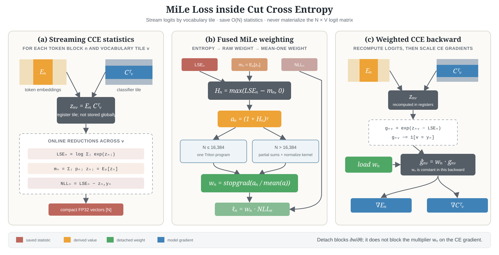

# MiLe Loss in Cut Cross Entropy

[MiLe Loss](https://aclanthology.org/2024.findings-naacl.18/) reweights the
next-token cross-entropy of each valid token using the entropy of the model's
current prediction. The CCE implementation keeps the released method's two
important operational details: the weights are normalized to mean one and are
detached from autograd.



## How to read the diagram

$N$ is the number of valid tokens after shift, padding, and `ignore_index`
filtering; $V$ is the vocabulary size. Subscript $n$ selects a token block and
subscript $v$ selects a vocabulary tile.

- **Panel (a)** is still the ordinary blockwise CCE forward. Each temporary
  $z_{nv}$ tile lives in registers. While vocabulary tiles stream through the
  program, CCE reduces them into three FP32 values per valid token:
  $\mathrm{LSE}_n$, $m_n=\mathbb E_{p_n}[z_n]$, and
  $\mathrm{NLL}_n$.
- **Panel (b)** is the MiLe-specific post-processing.
  $\mathrm{LSE}_n-m_n$ gives the predictive entropy, the entropy produces
  a raw weight $a_n$, and the global
  mean makes the final weights average to one. The two blue boxes are execution
  strategies for the same formula, not two different objectives.
- **Panel (c)** is CCE backward. It reconstructs one logit tile, forms the usual
  cross-entropy gradient, loads one saved scalar $w_n$, and multiplies the whole
  token row by it before accumulating $\mathrm dE$ and $\mathrm dC$.

The long $\mathrm{NLL}_n$ route in panel (b) is intentionally separate from weight
normalization: NLL does not determine the weight. It meets the detached weight
only at the final product $w_n\mathrm{NLL}_n$.

## Objective

For valid token $i$, logits $z_i$, probabilities $p_i$, and target $y_i$:

$$
\begin{aligned}
H_i &= \mathrm{logsumexp}(z_i)-\sum_j p_{ij}z_{ij}, \\
a_i &= (1+H_i)^\gamma, \\
w_i &= \mathrm{stop\_gradient}\!\left(\frac{a_i}{\mathrm{mean}_{k\in\mathcal V}(a_k)}\right), \\
\mathcal L_{\mathrm{MiLe}} &= \mathrm{mean}_{i\in\mathcal V}\!\left(-w_i\log p_{i,y_i}\right),
\end{aligned}
$$

where $\mathcal V$ is the set of valid tokens. The normalization preserves
$\mathrm{mean}_{i\in\mathcal V}(w_i)=1$, so MiLe changes the allocation
of gradient across tokens rather than deliberately increasing the average loss
scale. The stop-gradient does **not** remove the effect of the weight:

$$
\frac{\partial \mathcal L_{\mathrm{MiLe}}}{\partial\theta}
= \mathrm{mean}_{i\in\mathcal V}\!\left(
w_i\frac{\partial\mathrm{CE}_i}{\partial\theta}
\right).
$$

It only removes the additional `CE_i * dw_i/dtheta` term. Weights are recomputed
from the current model on every forward pass and then treated as constants for
that backward pass.

For $\gamma>0$, higher-entropy tokens receive a larger weight relative to
lower-entropy tokens in the same valid-token batch. Because the weight is
detached, this is an allocation rule for the CE gradient; it is not a direct
entropy-minimization gradient. At $\gamma=0$, every normalized weight is one and
the objective reduces to ordinary CCE.

## CCE execution path

MiLe is integrated into the existing CCE pipeline and never materializes the
`tokens x vocabulary` logit matrix in global memory.

1. CCE compacts `shift`, padding, and `ignore_index` into the valid-token domain.
2. The blockwise LSE forward kernel computes `logsumexp(z_i)`, the correct logit,
   and the probability-weighted mean logit `sum_j p_ij z_ij`.
3. `cce_mile_forward_kernel` constructs the detached, mean-normalized weights and
   weighted token losses.
4. The ordinary CCE reduction produces `mean`, `sum`, or unreduced output.
5. The CCE backward kernel reconstructs each logit block, forms
   `p_i - one_hot(y_i)`, loads one scalar MiLe weight per token, and scales the
   block before accumulating classifier and embedding gradients.

The entropy identity in step 2 is exact for the logits processed by CCE:

$$
H(p_i)=\mathrm{logsumexp}(z_i)-\mathbb E_{p_i}[z_i].
$$

No probability or full-logit matrix is stored.

### Numerical contract at extreme values

The fused weight path enforces the analytical entropy interval
$0 \leq H_i \leq \log(V)$. This prevents finite but extreme LSE and
mean-logit values from overflowing their subtraction and cannot change an
exact entropy value. The `gamma=1` pretraining path keeps its two-launch
multi-block schedule. Other exponents normalize in log space after subtracting
the largest observed `log(1 + H)`, so neither the power nor its reduction can
overflow before the common scale cancels.

For `reduction="mean"`, CCE evaluates `(NLL / valid_tokens) * weight` before
the final sum. Scaling before multiplication preserves a finite mean when an
individual unscaled product would exceed FP32. The unweighted NTP diagnostic is
accumulated as a mean for the same reason. The backward still applies the same
detached MiLe weight and `1 / valid_tokens` gradient scale.

Class-index targets outside `[0, V)`, excluding the configured `ignore_index`,
are removed by the existing valid-token compaction. They therefore cannot
reach indexed classifier loads and are handled consistently by forward and
backward without a host synchronization.

## Fused MiLe weight kernels

The token-wise post-processing has two execution paths:

- **Up to 16,384 valid tokens:** one Triton program computes entropy, raw
  weights, the global weight reduction, normalization, and weighted NLL.
- **More than 16,384 valid tokens:** `gamma=0/1` uses a bounded-block weight/sum
  kernel followed by normalization. General exponents first find the global
  `log(1 + H)` maximum, then use the same bounded normalized reduction.

The valid-token count is a runtime value, so different padding counts do not
compile one kernel per exact token count. Only the power-of-two block shape and
the specialized gamma mode affect compilation. $\gamma=0$ and $\gamma=1$ avoid a
general power operation; other values use
$\exp\!\left[\gamma\log(1+H)\right]$.

## Memory contract

Besides the state already required by CCE, MiLe retains compact FP32 vectors:

```text
mean_logit:  O(valid tokens)
mile_weight: O(valid tokens), saved for backward
token_loss:  O(valid tokens), transient until reduction
```

The multi-block path uses one FP32 scalar for the weight sum and, for a general
exponent, one scalar for the log-weight maximum. It does not allocate
`O(tokens x vocabulary)` storage. Setting `mile_enabled=False`
keeps the ordinary CCE path and does not request the MiLe mean-logit statistic.

## Usage

```python
from cut_cross_entropy import linear_cross_entropy

loss = linear_cross_entropy(
    embeddings,
    classifier,
    labels,
    shift=1,
    impl="cce_kahan_full_c",
    mile_enabled=True,
    mile_gamma=1.0,
)
```

MiLe can be combined with mu loss by setting both explicit flags. Padding and
`ignore_index` entries do not participate in the weight mean. MiLe is supported
by CCE implementations and is intentionally rejected by `impl="torch_compile"`.

Setting `return_loss_metrics=True` with `reduction="mean"` returns the loss and
a dictionary containing `ntp_ce_unweighted`, `mile_reweighting_delta`, and
`mu_loss`. These compact device scalars satisfy
$\mathcal L=\mathcal L_{\mathrm{NTP}}+\Delta_{\mathrm{MiLe}}+\mathcal L_\mu$; the unweighted
NLL mean is reduced inside the MiLe kernel rather than reconstructed from logits.

## Precision and gradient filtering

When MiLe requests the probability-weighted logit moment, the forward logit dot
products use IEEE precision. The backward uses aligned precision so that the
reconstructed probabilities correspond to the forward LSE. For pretraining,
`cce_kahan_full_c` keeps the full classifier gradient while retaining CCE's
embedding-gradient filtering; `cce_exact` is the audit path when exact gradient
comparison is required.

## Source and validation

- Weight kernel: [`cut_cross_entropy/cce_mile.py`](../cut_cross_entropy/cce_mile.py)
- CCE integration: [`cut_cross_entropy/cce.py`](../cut_cross_entropy/cce.py)
- Weighted backward: [`cut_cross_entropy/cce_backward.py`](../cut_cross_entropy/cce_backward.py)
- Dense and kernel equivalence tests: [`tests/test_cce_mile.py`](../tests/test_cce_mile.py)
- Extreme-value tests: [`tests/test_cce_numerical_extremes.py`](../tests/test_cce_numerical_extremes.py)
- Reproducible probes: [`benchmark/cce_numerical_extremes.py`](../benchmark/cce_numerical_extremes.py),
  [`benchmark/cce_full_extremes.py`](../benchmark/cce_full_extremes.py), and
  [`benchmark/cce_compile_extreme_profile.py`](../benchmark/cce_compile_extreme_profile.py)

The tests cover gamma values `0`, `0.5`, `1`, and `2`; both kernel-size paths;
bias, soft-capping, shift, padding/ignore entries, reductions, returned LSE, and
forward/backward agreement with a dense formulation.

The numerical-hardening run used an RTX 5090, PyTorch `2.13.0+cu130`, CUDA
`13.0`, and Triton `3.7.1`. The production-like compiled profile used BF16,
`32,704` valid tokens, `V=151,936`, `D=512`, and
`torch.compile(mode="max-autotune")`:

| 500-step result | main baseline | hardened |
|---|---:|---:|
| Mean forward+backward step | 82.445 ms | 81.721 ms |
| Minimum / maximum | 80.866 / 82.727 ms | 79.612 / 82.474 ms |
| Peak allocated | 767,428,608 B | 767,428,608 B |
| Incremental peak | 578,029,568 B | 578,029,568 B |
| Finite extreme MiLe cases | 3 / 24 | 24 / 24 |

Reproduce the checks without changing library compile flags:

```bash
PYTHONPATH=. python benchmark/cce_numerical_extremes.py --steps 500
PYTHONPATH=. python benchmark/cce_full_extremes.py --steps 500
PYTHONPATH=. python benchmark/cce_compile_extreme_profile.py --steps 500
PYTHONPATH=. python -m pytest -q tests/test_cce_numerical_extremes.py tests/test_cce_mile.py tests/test_cce_compile.py
```
